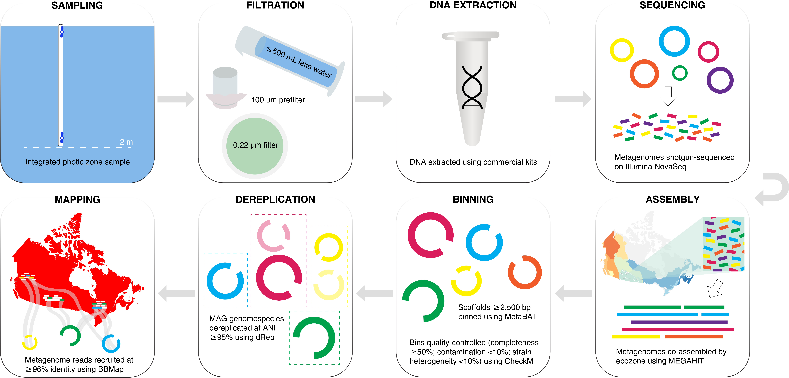

# A genome catalogue of lake bacterial diversity and its drivers at continental scale

Scripts associated with the submitted article

---

Garner RE, Kraemer SA, Onana VE, Fradette M, Varin M-P, Huot Y, Walsh DA. A genome catalogue of lake bacterial diversity and its drivers at continental scale. *Nature Microbiology*. https://doi.org/10.1038/s41564-023-01435-6.

---

### Scripts

- **01-pipeline.md** Workflow describing the generation, quality control, and annotation of the LakePulse metagenome co-assembly and metagenome-assembled genome (MAG) datasets.
